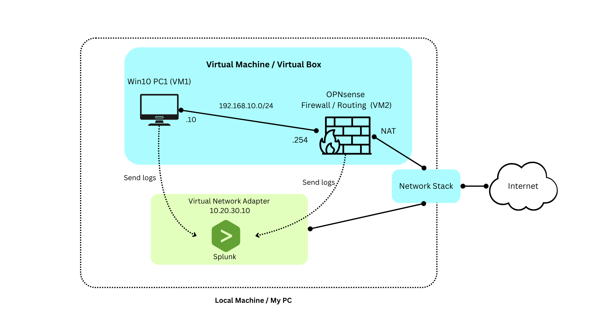

# Splunk Network Lab

This project is a small virtual lab for testing and configuring Splunk. It includes two Windows 10 PCs on separate network segments (LAN10: 192.168.10.0/24 and LAN20: 192.168.20.0/24), an OPNsense router/firewall, and a Splunk Enterprise instance running on the host Windows 11 machine. Windows hosts use the Splunk Universal Forwarder to send logs to the indexer. A Kali Linux VM on a NAT network is included to simulate an external attacker and produce adversary-like traffic.


---

## Overview

This lab simulates a small enterprise network using VirtualBox VMs:
- An OPNsense firewall/router with one LAN / one host 
- One Windows workstations / Host
  - `Windows PC1` (static IP `192.168.10.10`, gateway `192.168.10.254`) on `LAN10` (`192.168.10.0/24`).
- A Splunk Enterprise instance running on local machine. Splunk connect to virtual adapter Example Splunk IP: `10.20.30.10`.


## Technologies

- Virtualization: VirtualBox
- Firewall/Router: OPNsense
- Host VM: Windows (Win10)
- Observability: Splunk Enterprise (indexer/search head) on local Win11
- Forwarders: Splunk Universal Forwarder on Windows (Host)

---


## Topology

<p align="center"></p>

---

## VirtualBox | Host | OPNsense Setup

What to do:
- Create 1x Host-Only Network with IP `192.168.10.1/24`
- Modify Host VM Network to Host-only Adapter
- Modify OPNsense VM Network to Link Host VM

Steps (VirtualBox):
- Click `File` → `Tools` → `Network`.
- Under `Host-only Networks` click `Create`.
- Wait until the new Host-Only Ethernet Adapter is created, select it and choose `Configure Adapter Manually`.
- Add IPv4 Address: `192.168.10.1`
- Network Mask: `255.255.255.0`
- Remember the adapter name and click `Apply`.

Configure the Host VM (example: `Win10 Lab PC1`):
1. Select the Host VM → `Settings` → `Network`.
2. For `Adapter 1`, set `Attached to` → `Host-only Adapter` and choose the adapter you created.
3. Click `OK`.

Configure the OPNsense VM:
1. Select the OPNsense VM → `Settings` → `Network`.
2. Ensure `Adapter 1` is `NAT` (WAN).
3. Enable `Adapter 2` and set it to `Host-only Adapter` using the same adapter as the Host VM (this becomes the OPNsense LAN).
4. Click `OK`.

Next, start both VMs to configure network settings inside the guests.

## Setup Host Windows 10

Below is a short video showing how to configure your network adapter. Click the thumbnail to open the video.

[](https://www.youtube.com/watch?v=63-iVcseSps)

Example Host IP settings used in this lab:

- Host IP: `192.168.10.10`
- Gateway: `192.168.10.254`
- Mask: `255.255.255.0`
- DNS: `1.1.1.1`, `8.8.8.8`

Please ensure the Host VM firewall is off (or the rules are configured) to allow connections between Host and OPNsense while you test the lab.

## Setup OPNsense

Follow the YouTube video showing how to configure OPNsense in VirtualBox. Click the thumbnail to open the video.

[](https://www.youtube.com/watch?v=naYU8UR5BhQ)

- My WAN (NAT) adapter is `em0` in OPNsense (Adapter 1 in VirtualBox).
- `em1` is Adapter 2 and connects the OPNsense LAN to the Host VM.
- When configuring `em1`, set the LAN gateway to match the host gateway (example: `192.168.10.254`) and use the same subnet mask.

## After completion

You should be able to ping the Host IP address from the OPNsense terminal and vice versa.
You should be able to ping the Host IP address from the OPNsense terminal and vice versa.

---

# Creating Virtual Network Adapter (Windows 10 | 11)

- Create a new virtual network adapter to assign a static IP address for Splunk services.
- The static IP will be used for Splunk Web and other services that need a reachable host address.
- When configuring a Splunk Universal Forwarder on the host, the forwarder needs the indexer IP and port (not `localhost`).
- Splunk Enterprise uses `localhost` (127.0.0.1) by default; using `localhost` as the receiver IP from other machines will not work because it refers only to the local loopback interface.

## Using Device Manager to create the virtual adapter

Below is a short video showing how to create a new virtual adapter. Click the thumbnail to open YouTube.

[](https://www.youtube.com/watch?v=wNzXss3rtXw)

After creating the adapter, configure it with a static IP. Example values used in this guide:

- IP address: `10.20.30.10`
- Netmask: `255.255.255.0` (prefix `/24`)

Video above also shows steps to add static IP to virtual network adapter


## Setup firewall rules (Host) — allow Splunk ports

What you need:

- The newly created virtual adapter IP (example: `10.20.30.10`).
- The Splunk ports to allow inbound to the host:

```text
Management (Splunkd RPC) -> TCP 8089
Web UI                  -> TCP 8000
Indexer receiver        -> TCP 9997
Syslog (OPNsense)       -> TCP 514
```

Windows GUI steps (Windows Defender Firewall → Advanced Settings):
1. Open `Windows Defender Firewall with Advanced Security`.
2. Click `Inbound Rules` → `New Rule...`.
3. Choose `Port` → Next.
4. Select `TCP`  and `Specific local ports` → enter the port number (e.g. `8089`) → Next.
5. Choose `Allow the connection` → Next.
6. Apply to all profiles (Domain, Private, Public) or choose appropriately → Next.
7. Give the rule a descriptive name (e.g. `Allow Splunk Management 8089`) → Finish.
8. Repeat for each required port.

Other Method: PowerShell example (creates inbound allow rules for TCP ports):

```powershell
New-NetFirewallRule -DisplayName "Allow Splunk Mgmt 8089" -Direction Inbound -Action Allow -Protocol TCP -LocalPort 8089 -Profile Any
New-NetFirewallRule -DisplayName "Allow Splunk Web 8000" -Direction Inbound -Action Allow -Protocol TCP -LocalPort 8000 -Profile Any
New-NetFirewallRule -DisplayName "Allow Splunk Receiver 9997" -Direction Inbound -Action Allow -Protocol TCP -LocalPort 9997 -Profile Any
New-NetFirewallRule -DisplayName "Allow Syslog UDP 514" -Direction Inbound -Action Allow -Protocol UDP -LocalPort 514 -Profile Any
```

If you want to restrict rules to the new adapter only, create the rule and then edit `InterfaceTypes` or use the `-InterfaceAlias` parameter where applicable.

## After completion — verify connectivity

From the host, test the adapter locally:

```powershell
Test-NetConnection -ComputerName 10.20.30.10 -Port 8000
```

From OPNsense (or another VM), test ping and TCP connectivity (adjust for your environment):

CMD (ping):

```cmd
ping 10.20.30.10
```

PowerShell (TCP port test):

```powershell
Test-NetConnection -ComputerName 10.20.30.10 -Port 9997
```

If you see successful replies and open ports, the adapter and firewall rules are working.

---

# Splunk Setup

Splunk by default use IP `localhost` or `127.0.0.1` but VMs can't use that IP since Splunk Web or the Indexer are outside of the VMs network (running on the local machine). You need to bind Splunk to the virtual adapter IP (example `10.20.30.10`).

Steps (Splunk on Windows):

1. Find the Splunk installation folder (usually under `C:\Program Files\Splunk`).
2. Open `etc\system\local\web.conf` and add:

```ini
[settings]
mgmtHostPort = <YOUR-IP>:8089
# Example
mgmtHostPort = 10.20.30.10:8089
```

3. Open `splunk-launch.conf` in the Splunk install root and add:

```text
SPLUNK_BINDIP=<YOUR-IP>
# Example
SPLUNK_BINDIP=10.20.30.10
```

4. Restart Splunk, then access the web UI at `http://<YOUR-IP>:8000`.


## Setup Splunk Universal Forwarder (Host VM)

Use the virtual adapter IP (example `10.20.30.10`) as the receiving indexer address when configuring the forwarder.

Click the thumbnail to open the forwarder setup video on YouTube:

[](https://www.youtube.com/watch?v=Uvxt3MeZN0c)

---

# Setup OPNsense syslog

To enable Splunk to receive logs from the OPNsense VM, configure both OPNsense and Splunk to send/receive syslog over TCP port 514.

## At OPNsense Web GUI

1. Identify the OPNsense LAN IP (e.g., `192.168.10.254`).
2. From the OPNsense GUI: `System` → `Settings` → `Logging` → `Remote` → `Add`.
3. In the edit destination settings:
  - Enable the destination.
  - Transport: `TCP(4)`.
  - Application / Levels / Facilities: select as needed (or `Select All`).
  - Hostname: set to Splunk Web / receiver IP (example `10.20.30.10`).
  - Port: `514`.
  - Leave `rtc5424` as default or unticked.
4. Save and apply.

## At Splunk Web

Install the recommended OPNsense Apps from Splunkbase (`OPNsense Add-on for Splunk` and `OPNsense App for Splunk`) then configure the appropriate Data Input to receive the syslog stream.

Reference: https://netwerklabs.com/ship-opnsense-firewall-logs-to-splunk-siem/

---

# End Guide

Inside Splunk Web, Under Search & Reporting, you should able to see logs from Host VM and OPNsense

At search bar,  insert

for Host VM (put inside "" the name of the your host PC ): 
    windows host="DESKTOP-VNED4CP"

for OPNsense:
    source="tcp:514" index="opnsense"   sourcetype="opnsense:syslog"


